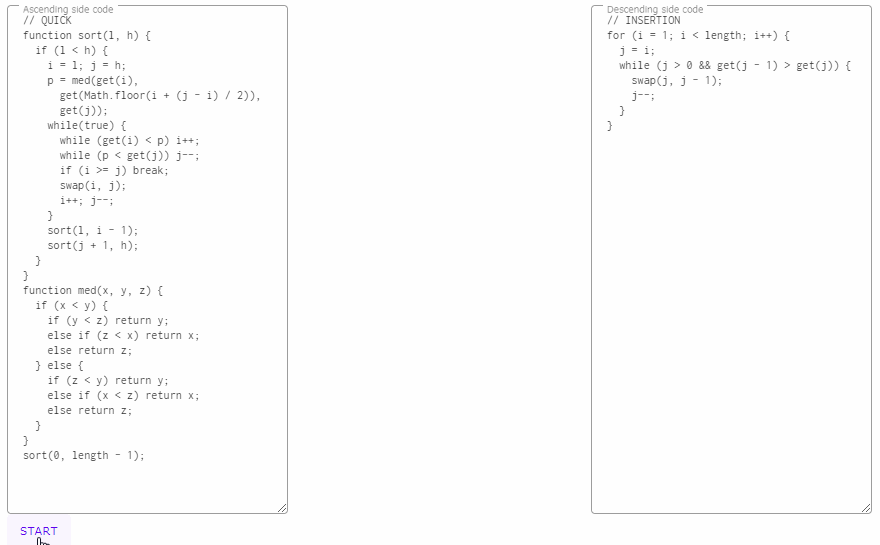

# sort-war ([DEMO](https://abagames.github.io/sort-war/))

A quick sort program and an insertion sort program sort a same array simultaneously. The quick sort program tries to sort the array in ascending order, and the insertion sort program tries to sort the array in descending order.

Each program is written in JavaScript and interpreted by [JS-Interpreter](https://github.com/NeilFraser/JS-Interpreter). A step() function of JS-Interpreter is applied to each program alternately.

